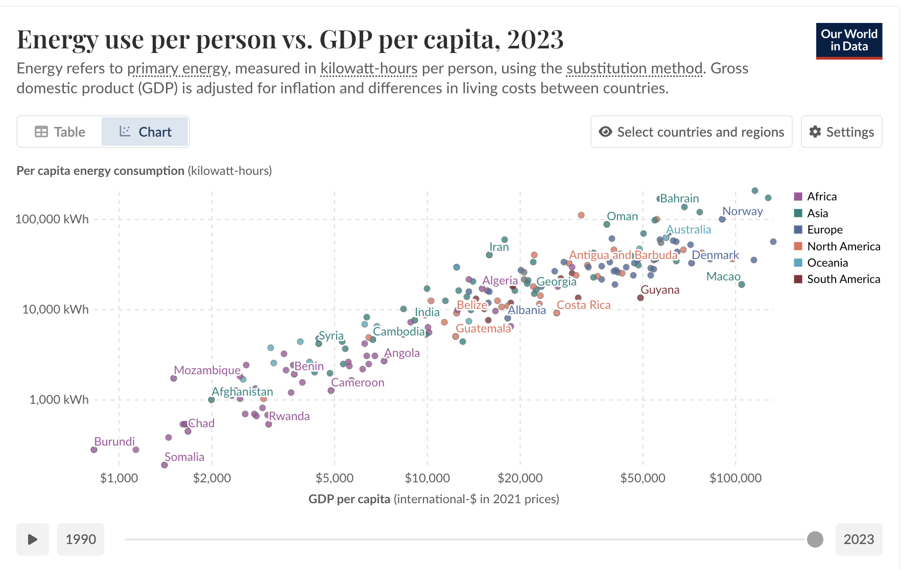

# Energy

*September 15, 2025*

---

Energy is the currency of the world. It's one of the few concepts i have found which applies equally well at all scales. Be it plants, insects, animals, humans, countries, or space-faring civilisations.

At the smallest scale, every living cell runs on ATP. Our bodies spend and regenerate it constantly.

Plants produce sugary, energy rich fruits and nectar as a form of payment for birds and animals to help disperse their seeds, pollen. Energy that the plants could very much use for themselves, but must package it into little colorful balls to bribe animals to help spread their progeny.

There's even counterfeit plants just like there are con-men in the real economy which produce a substance which tricks our sugar sensors but in fact give us no calories/energy. ([Goodhart's law](https://en.wikipedia.org/wiki/Goodhart%27s_law) strikes again??). This whole section was inspired by this fascinating [video](https://youtu.be/6pTv-2XPBl4?si=6gKSBWba7USvLjKv), def recommend.

On a more macro scale, say levels of countries, theres a power law relation between countries' GDP and energy usage. It’s a self-reinforcing feedback loop: more energy enables more growth, and more growth demands more energy.

Play around with the time series [here](https://ourworldindata.org/grapher/energy-use-per-person-vs-gdp-per-capita?time=2023)

A lot of this i learned when i started playing factorio (highly recommend). It becomes very apparent, very quickly the importance of setting up and fiercely protecting all your energy sources. The first thing you have to do as you drop in the alien planet is mine for coal. Can't do anything without it. Then you move onto steam turbines and realise how much better it is not having to move coal around as much (still need it for heat though). Then comes petroleum, solid fuels, solar and ultimately nuclear.

It's really something to think how many substances "contain" energy and our unique position to be able to harness them, with each leap unlocking bigger jumps in population, technology and living standards.

We can zoom out even further and run the thought experiment that if we were ever to come across an alien civilization, by what metric could we judge how advanced they are? There's good reason to believe the right metric is energy use. This perfectly aligns with our experience here on earth. The greater the energy use of a country, the better off it is. And this though experiment has a cool name, the [Kardashev scale](https://en.wikipedia.org/wiki/Kardashev_scale). Earth stands at around 0.7 level on the scale. We really have got some work to do.

There's absolutely no reason why our moon shouldn't be covered in nuclear plants working 24/7 transporting energy back to the earth. Or serve as a charging station on our way to mars and beyond. And the dyson spheres can't be built fast enough.

---

*Back to [home](/)*